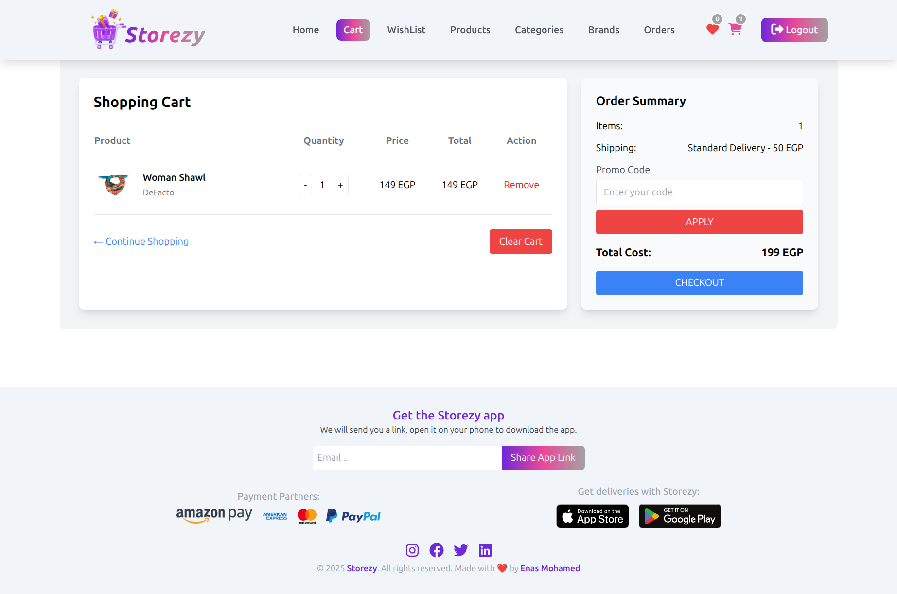
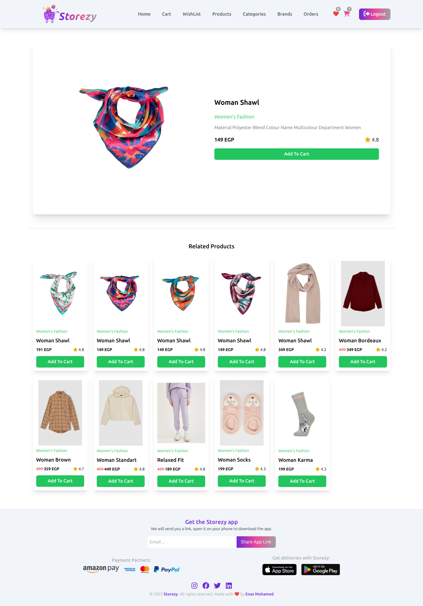
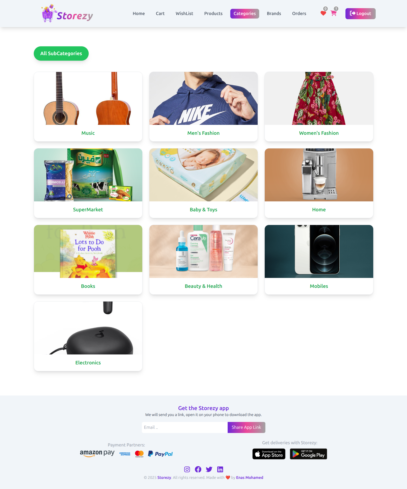
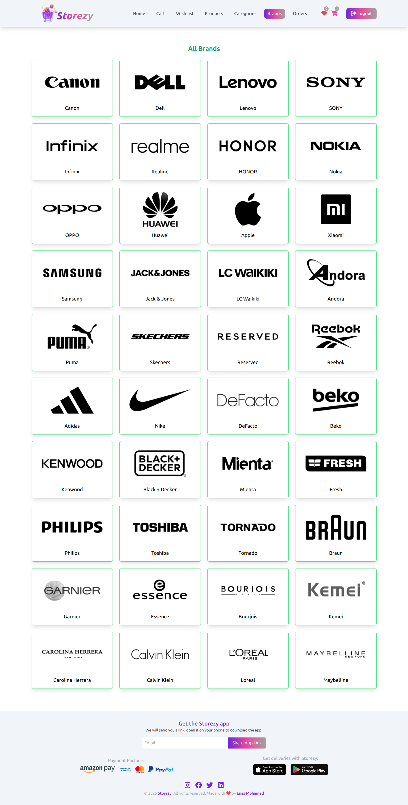

# 🛒 React Ecommerce Project

مشروع متجر إلكتروني بسيط مبني باستخدام **React + Vite** يتيح للمستخدمين تسجيل حساب، تسجيل الدخول، استعادة كلمة المرور، واستعراض المنتجات مع إمكانية إضافتها إلى السلة.

---

## 🔐 Test Account (للتجربة)

تقدر تسجل الدخول مباشرة باستخدام الحساب التجريبي:

- **Email:** test@shop.com
- **Password:** A1234567

---

## 🚀 Features

- ✅ Register & Login
- ✅ حساب تجريبي جاهز للتجربة
- ✅ Reset Password (مع تحقق من الحساب)
- ✅ Validation للباسورد (≥ 8 حروف + حروف كبيرة وصغيرة + أرقام)
- ✅ Add to Cart من الصفحة الرئيسية ومن صفحة تفاصيل المنتج

---

## ⚙️ Installation & Run

1. اعمل Clone للمشروع:

   ```bash
   git clone https://github.com/enasmohmed/Ecommerce-React.git

   ```

2. ادخل على فولدر المشروع:

    ```bash
   cd Ecommerce-React
   ```

3. نزّل الـ dependencies:

    ```bash
   npm install
   ```

4. شغّل المشروع:

    ```bash
   npm run dev
   ```

🛠️ Technologies Used

    React.js (with Vite) ⚡

    React Router

    Axios

    Formik + Yup (لإدارة الـ Forms والـ Validation)

    TailwindCSS + CSS Modules

    React Helmet

📂 Project Structure

    src/
        │── components/       # Components مثل Login, Register, ProductCard
        │── Context/          # Auth Context
        │── pages/            # Pages زي Home, Product Details
        │── assets/           # الصور والـ static files
        │── App.jsx           # Root Component
        │── main.jsx          # Entry Point


## 📸 Screenshots

### 🖼️ Login Page

    

### 🖼️ Home Page

    
    
    

### 🖼️ All Products

    

### 🖼️ Cart

    

### 🖼️ Product Details

    

### 🖼️ All Categories

    

### 🖼️ All Brands

    


📄 License

    هذا المشروع للتعلم والعرض فقط – مفتوح المصدر ويمكنك التعديل عليه بحرية.
